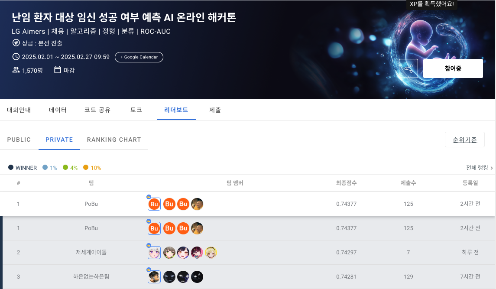
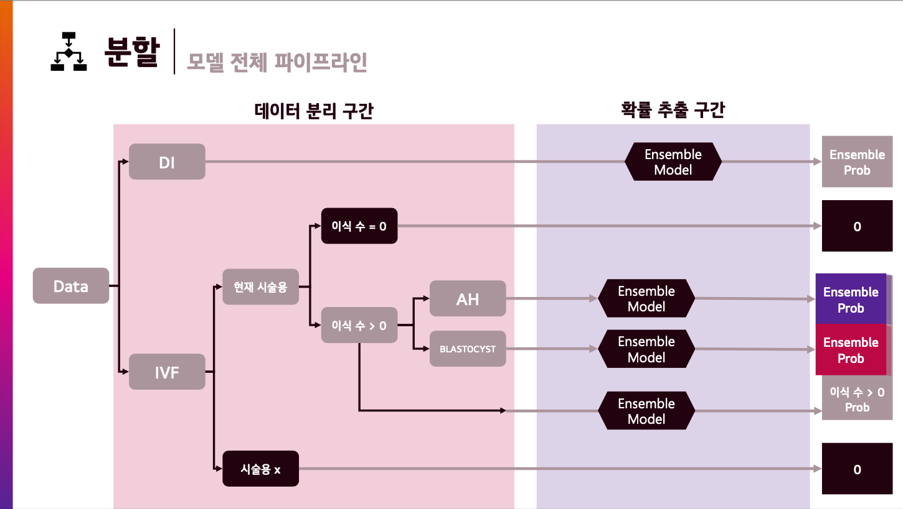

# LG Aimers 6th Predicting Pregnancy Success in Infertility Patients

## Abstract
Infertility is an increasingly significant medical issue worldwide, with many couples experiencing long-term physical and mental burdens. Patients undergoing infertility treatments often face high costs and significant psychological stress during the process, making it crucial to maximize the chances of pregnancy with the minimal number of procedures.

To address this need, healthcare institutions have shown great interest in AI-based models for predicting pregnancy success. AI-driven solutions can analyze vast amounts of infertility treatment data to support optimal decision-making and help establish personalized treatment plans for patients. This not only reduces the burden of procedures on patients but also serves as a key competitive factor for healthcare providers in offering differentiated services.

This hackathon focuses on developing an AI model that predicts "pregnancy success" using infertility patient data and explores the optimal features that determine pregnancy. Based on this, the project involved developing an infertility prediction AI model and uncovering various insights derived from it.

---

<h3> 👪 Team Members </h3>
<table>
  <tr>
    <td> 
  1 
 </td>
    <td> 
  2 
 </td>
    <td> 
  3 
 </td>
    <td> 
  4 
 </td>
  </tr>
  <tr>
    <td> 
 <b>Jun-hyeok, Seo (BuAs)</b> 
 </td>
    <td> 
 <b>Da-Woon, Kim</b> 
 </td>
    <td> 
 <b>Dong-hyeok, Shin</b>  
  </td>
    <td> 
 <b>Sang-hyeok, Seo</b> 
 </td>
  </tr>
  <tr>
    <td>  </td>
    <td>  </td>
    <td>    </td>
    <td>  </td>
  </tr>
  <tr>
    <td> 
 <a href="https://github.com/SeoBuAs">  
 </td>
    <td> 
 <a href="https://github.com/Daw-ny">  
 </td>
    <td>  
  <a  href="https://github.com/HyeokHam">    
  </td>
    <td> 
 <a href="https://github.com/devhyuk96">  
 </td>

  </tr>
</table>

---

### 🏆 Execution Results
- **LG Aimers 6th Online Hackathon** 
  - Public Rank: 1st (AUC : 0.74350)
  - Private Rank: 1st (AUC : 0.74377)
  - Competitors: 794 teams

<table>
  <tr>
    <td></td>
    <td></td>
  </tr>
</table>

- **LG Aimers 6th Offline Hackathon**  
  - Public Rank: 8th (Brier Score + F1 : 0.66305)
  - Private Rank: 13th (Brier Score + F1 : 0.66106)
  - Competitors: 27 teams

---
### Our Presentation
  <tr>
    <td></td>
  </tr>
You can check our presentation at this repository.

---

### Why we can't win at offline hackathon?
**1. Teamwork**
We failed to operate as a true team because there wasn't enough collaboration, and we didn't actively share our views with one another like we should have. All the team members wanted to handle the modeling aspect. However, it now seems necessary that we should have divided the responsibilities, creating distinct EDA and modeling teams.

**2. EDA**
We didn't perform the necessary Exploratory Data Analysis (EDA). The variables seemed similar, but it was entirely new data, requiring us to redo the EDA. However, we didn't recognize this necessity until there were only 4 hours remaining in the offline hackathon. I wonder if my failure to conduct EDA was partly due to a sense of complacency or perhaps a bit of arrogance, stemming from having won first place in the previous online hackathon.

**3. Sickness**
Because I (Seo Buas) failed to manage my health, I suffered from severe stomach cramps on the day of the hackathon. It was my fault for not taking better care of myself, especially considering I was effectively a key player/strength for the team.

Reflecting on these experiences, I've learned valuable lessons about the importance of soft skills for data scientists and the critical need to consistently perform thorough Exploratory Data Analysis (EDA). I also recognized the significance of individual health management for team members, and deeply understood the importance of both leadership and fellowship within the team dynamic.

Based on these insights, I believe I can grow into a better data scientist.

**I am very grateful to the LG Aimers team for providing me with such a valuable learning experience. Thank you.**

