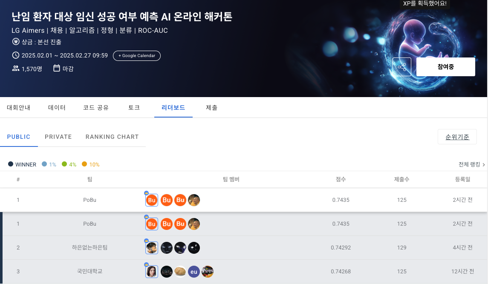

# LG Aimers 6th Predicting Pregnancy Success in Infertility Patients

## Abstract
Infertility is an increasingly significant medical issue worldwide, with many couples experiencing long-term physical and mental burdens. Patients undergoing infertility treatments often face high costs and significant psychological stress during the process, making it crucial to maximize the chances of pregnancy with the minimal number of procedures.

To address this need, healthcare institutions have shown great interest in AI-based models for predicting pregnancy success. AI-driven solutions can analyze vast amounts of infertility treatment data to support optimal decision-making and help establish personalized treatment plans for patients. This not only reduces the burden of procedures on patients but also serves as a key competitive factor for healthcare providers in offering differentiated services.

This hackathon focuses on developing an AI model that predicts "pregnancy success" using infertility patient data and explores the optimal features that determine pregnancy. Based on this, the project involved developing an infertility prediction AI model and uncovering various insights derived from it.

---

<h3> 👪 Team Members </h3>
<table>
  <tr>
    <td> 
  1 
 </td>
    <td> 
  2 
 </td>
    <td> 
  3 
 </td>
    <td> 
  4 
 </td>
  </tr>
  <tr>
    <td> 
 <b>Jun-hyeok, Seo (BuAs)</b> 
 </td>
    <td> 
 <b>Da-Woon, Kim</b> 
 </td>
    <td> 
 <b>Dong-hyeok, Shin</b>  
  </td>
    <td> 
 <b>Sang-hyeok, Seo</b> 
 </td>
  </tr>
  <tr>
    <td>  </td>
    <td>  </td>
    <td>    </td>
    <td>  </td>
  </tr>
  <tr>
    <td> 
 <a href="https://github.com/SeoBuAs">  
 </td>
    <td> 
 <a href="https://github.com/Daw-ny">  
 </td>
    <td>  
  <a  href="https://github.com/HyeokHam">    
  </td>
    <td> 
 <a href="https://github.com/devhyuk96">  
 </td>

  </tr>
</table>

---

### 🏆 Execution Results
- **LG Aimers 6th Online Hackathon** 
  - Public Rank: 1st (AUC : 0.74350)
  - Private Rank: 1st (AUC : 0.74377)
  - Competitors: 794 teams

<table>
  <tr>
    <td></td>
    <td></td>
  </tr>
</table>

- **LG Aimers 6th Offline Hackathon**  
  - Public Rank: 8th (Brier Score + F1 : 0.66305)
  - Private Rank: 13th (Brier Score + F1 : 0.66106)
  - Competitors: 27 teams

---
### Our Presentation
  <tr>
    <td></td>
  </tr>
You can check our presentation at this repository.

---

### Why we can't win at offline hackathon?
